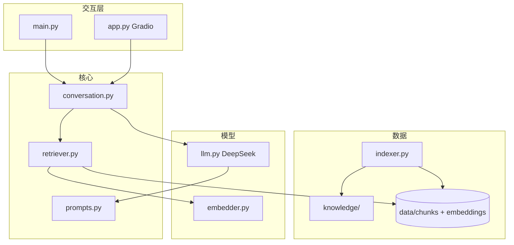

# 校园智能场馆匹配平台 — 实现阶段规划

> 本文档依据《人工智能基础》大作业任务书**方向一**要求整理，并结合本项目目标（语义检索、多轮对话、边界处理、Gradio 网页）给出分阶段分析与实施参考。  
> 配套文件：`AI协作日志.md`（协作记录）、`实验报告.md`（最终提交报告）。

---

## 1. 项目定位与任务书对照

### 1.1 选题归属

任务书方向一原题为 **「校园智能问答助手（知识库 + RAG）」**，推荐主题之一为 **「图书馆与场馆助手」**。  
本项目 **「校园智能场馆匹配平台」** 落在该主题下：根据用户自然语言需求，基于本校真实场馆资料进行检索与推荐。

### 1.2 必做 vs 进阶 vs 本项目目标

| 任务书条目 | 类型 | 本项目计划 |
|------------|------|------------|
| 知识库 ≥15 段本校真实资料 | 必做 | P0–P1 完成录入与切块 |
| RAG：检索相关段落后拼入 Prompt | 必做 | P1–P2 建立索引 + 检索 |
| 多轮对话（上下文连续） | 必做 | P3 `conversation.py` |
| 边界处理（库外不编造） | 必做 | P3 `prompts.py` + 检索阈值 |
| 命令行交互界面 | 必做 | P4 `main.py` |
| 必须使用 DeepSeek API | 硬性要求 | P0 配置与 `llm.py` |
| Embedding 语义检索 | 进阶加分 | P2（用户明确要求） |
| 回答标注引用来源 | 进阶加分 | P6（可选） |
| Gradio 网页聊天 | 进阶加分 | P5（用户明确要求） |
| 带/不带知识库对比实验 | 进阶加分 | P4/P6 写入实验报告 |

### 1.3 技术栈总览

| 层次 | 技术选型 | 说明 |
|------|----------|------|
| 大模型 | DeepSeek API（`openai` SDK，`deepseek-chat`） | 任务书强制；`temperature` 建议 0.3–0.5 |
| 向量化 | 本地 `sentence-transformers` 或 API Embedding | 对话必须 DeepSeek；向量可用本地模型（答辩需说明） |
| 检索 | 余弦相似度 Top-K + 相似度阈值 | 替代当前关键词匹配 |
| 交互 | CLI（`main.py`）+ Gradio（`app.py`） | CLI 必做；网页为加分与用户目标 |
| 配置 | `config.example.py` → 本地 `config.py` | API Key 不得提交仓库 |

---

## 2. 目标架构

### 2.1 数据流

```text
用户输入（CLI / Gradio）
    ↓
conversation.py 维护多轮 messages
    ↓
retriever.py：query 向量化 → Top-K 文本块
    ↓
prompts.py：拼装「用户需求 + 参考资料」
    ↓
llm.py：DeepSeek 生成回答
    ↓
写回 history，返回用户
```

### 2.2 模块职责（目标态）

| 模块 | 职责 |
|------|------|
| `knowledge/` | 原始 Markdown 场馆资料 |
| `indexer.py` | 切块、向量化、写入 `data/` |
| `embedder.py` | 文本 → 向量 |
| `retriever.py` | 语义检索，返回带元数据的 chunks |
| `prompts.py` | System Prompt、RAG 模板、边界话术 |
| `conversation.py` | 多轮 history、`turn()` / `reset()` |
| `llm.py` | DeepSeek 调用与异常处理 |
| `main.py` | 命令行入口 |
| `app.py` | Gradio 网页入口 |

### 2.3 架构图



---

## 3. 分阶段详细分析

---

### 阶段 P0：对齐脚手架 + DeepSeek 跑通

**周期建议**：1–2 天  
**阶段目标**：达到任务书「起步脚手架能运行」状态，并完成 API 与知识库最低限度准备。

#### 要做什么

1. 复制 `config.example.py` 为 `config.py`，填写 DeepSeek API Key。  
2. 将 `API_BASE`、`MODEL_NAME` 改为 DeepSeek（见任务书第六节）。  
3. 增强 `llm.py`：超时重试、API 异常友好提示。  
4. 在 `knowledge/` 录入本校场馆真实资料，规划为 **≥15 段**（可先录入再于 P1 正式切块计数）。  
5. 用 `python main.py` 验证能收到模型回复。

#### 技术要点

```python
# config.py 推荐值（示例）
API_BASE = "https://api.deepseek.com"
MODEL_NAME = "deepseek-chat"
# 问答场景
TEMPERATURE = 0.3  # 或 0.5，稳定优先
```

任务书 6.3 节说明：多轮对话依赖把 **完整 history** 传入 `messages`；P0 可仍用单轮，但 `llm.chat` 必须支持传入 `list[dict]`。

#### 产出物

- [ ] 可运行的 `config.py`（不提交 Git）  
- [ ] `llm.py` 带基础异常处理  
- [ ] `knowledge/` 中有多份本校场馆 `.md`  
- [ ] README 中补充 DeepSeek 配置说明  

#### 风险与注意

| 风险 | 应对 |
|------|------|
| API 超时/限流 | `try/except` + 重试 1–2 次；调试时减少调用次数 |
| Key 泄露 | `.gitignore` 排除 `config.py` |
| 知识库内容过少 | 答辩前必须满 15 段，P0 可先 5–8 份再补 |

#### 完成标准

- 命令行输入一句话，能稳定返回 DeepSeek 生成的中文回复（不崩溃）。

---

### 阶段 P1：文档切块 + 索引构建

**周期建议**：1 天  
**阶段目标**：为 RAG 建立可复现的「段落级」知识单元与持久化索引。

#### 要做什么

1. 新增 `indexer.py`：扫描 `knowledge/*.md`，切分为 chunks。  
2. 为每个 chunk 记录元数据：`id`、`source_file`、`title`（可选）、`text`。  
3. 输出 `data/chunks.json`（文本索引）。  
4. 提供命令：`python indexer.py --rebuild`（知识库更新后重建）。

#### 切块策略（任选一种，写入实验报告）

| 策略 | 做法 | 适用场景 |
|------|------|----------|
| 按标题 | 以 `#` / `##` 为界 | 每馆一个结构清晰的 md |
| 固定长度 | 如 300 字一块，重叠 50 字 | 长文档、无小标题 |
| 按列表项 | 每条设施/规则为一块 | 条目化场馆说明 |

**建议**：场馆类资料多用「按标题 + 过长段落再切」，便于引用来源标注。

#### 技术要点

- 切块后统计段落数，确认 **≥15**。  
- `data/` 目录纳入项目，体积大的 `embeddings.npz` 可在 P2 再生成；P1 可先只有 `chunks.json`。

#### 产出物

- [ ] `indexer.py`  
- [ ] `data/chunks.json`  
- [ ] 文档中记录：切块规则、段落总数  

#### 风险与注意

| 风险 | 应对 |
|------|------|
| 块太大 | Prompt 超长、费用高；单块建议 200–500 字 |
| 块太碎 | 语义不完整；合并过小段落 |
| 示例数据未删 | 提交前删除 `示例-体育馆.md` 或改为真实校名 |

#### 完成标准

- 执行 `indexer.py` 后，`chunks.json` 中条目 ≥15，且每条条目可追溯到源文件。

---

### 阶段 P2：向量语义检索

**周期建议**：2–3 天  
**阶段目标**：用 **embedding + 余弦相似度** 替代 `retriever.py` 中的关键词匹配。

#### 要做什么

1. 新增 `embedder.py`：将任意文本编码为向量。  
2. 在 `indexer.py` 中为每个 chunk 计算向量，保存 `data/embeddings.npz`（与 chunk 顺序一致）。  
3. 改造 `retriever.retrieve(query)`：  
   - query 向量化  
   - 与库中向量算余弦相似度  
   - 返回 Top-K（K 由 `config.TOP_K` 控制）  
4. 设置 **`SIMILARITY_THRESHOLD`**：低于阈值视为「无相关依据」。

#### 向量化方案对比

| 方案 | 实现 | 优点 | 缺点 |
|------|------|------|------|
| A. 本地 sentence-transformers | `paraphrase-multilingual-MiniLM-L12-v2` 等 | 免费、离线、中文尚可 | 首次下载模型；需写清与 DeepSeek 的分工 |
| B. API Embedding | 若平台提供兼容接口 | 与云端统一 | 可能额外计费；需查 DeepSeek 是否提供 |

**推荐**：课程实践常用 **方案 A** 做检索，**DeepSeek 仅负责生成**；实验报告中说明选型理由即可。

#### 技术要点

```text
score = cosine(embed(query), embed(chunk))
若 max(score) < THRESHOLD → 返回 []，交给边界 Prompt 处理
```

依赖示例：`numpy`、`sentence-transformers`（若选本地）。

#### 产出物

- [ ] `embedder.py`  
- [ ] `data/embeddings.npz`  
- [ ] 更新后的 `retriever.py`  
- [ ] `requirements.txt` 更新  

#### 风险与注意

| 风险 | 应对 |
|------|------|
| 阈值过高 | 总有「查不到」→ 调低或按测试集标定 |
| 阈值过低 | 无关段落进 Prompt → 易幻觉 → 提高阈值 |
| 索引未更新 | 改 knowledge 后必须 `--rebuild` |

#### 完成标准

- 用户问「适合羽毛球的小场馆」，能检索到含羽毛球/体育馆语义相近的块（即使用词不完全一致）。  
- 与关键词检索相比，在实验报告中至少有 2–3 个对比例子。

#### 与实验报告的关系

- **方案设计**：画 RAG 流程图（索引构建 → 检索 → 生成）。  
- **核心技术与实现**：说明为何从关键词升级到向量、阈值如何设定。

---

### 阶段 P3：多轮对话 + 边界处理

**周期建议**：2–3 天  
**阶段目标**：满足任务书必做的 **上下文连续** 与 **库外不编造**。

#### 3.1 多轮对话

**新增 `conversation.py`**，核心逻辑对齐任务书 6.3：

```python
history = [{"role": "system", "content": SYSTEM_PROMPT}]

def turn(user_input: str) -> str:
    # 1. 检索（见下方「检索 query」策略）
    chunks = retrieve(user_input)  # 或 retrieve(rewrite_query(history))
    # 2. 拼装本轮 user 消息（含 RAG 资料）
    user_msg = build_rag_user_message(user_input, chunks)
    history.append({"role": "user", "content": user_msg})
    # 3. 调用 LLM
    answer = chat(history)
    history.append({"role": "assistant", "content": answer})
    return answer

def reset():
    history.clear()
    history.append({"role": "system", "content": SYSTEM_PROMPT})
```

**检索 query 策略**（可分期实现）：

| 策略 | 说明 | 阶段 |
|------|------|------|
| 仅用当前句 | 实现简单 | P3 首选 |
| 历史拼接后检索 | 把上一轮 assistant + 当前 user 拼成 query | P3 后期或 P6 |
| LLM 改写为独立问题 | 效果最好，多一次 API 调用 | P6 优化 |

**改造 `main.py`**：整个会话共用一个 `Conversation` 实例；支持命令 `reset` 清空历史。

#### 3.2 边界处理（三层）

```text
┌─────────────────────────────────────────┐
│ L1 检索层：阈值 / 空库 / Top-K 为空      │
├─────────────────────────────────────────┤
│ L2 Prompt 层：仅依据参考资料；无则拒答   │
├─────────────────────────────────────────┤
│ L3 生成后检查（可选）：无引用却很肯定    │
└─────────────────────────────────────────┘
```

**`prompts.py` 建议内容**：

1. **SYSTEM_PROMPT**  
   - 角色：校园场馆匹配助手  
   - 规则：只根据「参考资料」回答；不得编造场馆名、时间、电话  
   - 无资料时：说明「知识库未记载」，建议联系具体部门（填写本校真实单位）

2. **build_rag_user_message**  
   - 结构化列出参考资料编号、来源文件名、正文  
   - 无资料时使用 `NO_CONTEXT_TEMPLATE`，禁止模型发挥

3. **OUT_OF_SCOPE_TEMPLATE**  
   - 用户问教务/成绩/选课等非场馆话题时的固定引导

#### 测试用例（建议写入 `docs/测试用例.md`）

| 编号 | 输入 | 期望行为 |
|------|------|----------|
| T1 | 约 200 人篮球活动，要室内 | 推荐具体场馆，理由含容量/设备 |
| T2 | 如何申请转专业 | 拒答或说明非本库范围，给咨询渠道 |
| T3 | 东区有哪些场馆？→ 第二个怎么预约？ | 第二轮理解「第二个」指上一轮列表 |
| T4 | 火星上的体育馆 | 相似度低，不编造场馆 |
| T5 | 空输入 / 纯符号 | 提示重新描述需求 |

#### 产出物

- [ ] `conversation.py`  
- [ ] `prompts.py`  
- [ ] 改造 `main.py`  
- [ ] `docs/测试用例.md`  

#### 完成标准

- T1–T5 人工跑通，结果符合预期；截图可进实验报告「运行效果展示」。

#### 回答灵活性（后期）

本阶段 Prompt 以 **严谨、防幻觉** 为主（`temperature` 偏低）。  
特定场景（如「帮我对比两个场馆」「写一份活动预案」）可在 P6 增加意图分支或略提高 `temperature`，**不阻塞 P3 验收**。

---

### 阶段 P4：CLI 联调与可复现

**周期建议**：1 天  
**阶段目标**：他人按 README 能完整跑通；形成报告与答辩素材。

#### 要做什么

1. 完善 `README.md`：环境、配置、`indexer.py --rebuild`、`main.py`、`app.py`（若已完成 P5 则一并写）。  
2. `.gitignore`：`config.py`、`__pycache__/`、`.venv/` 等。  
3. 执行全部测试用例，记录典型成功/失败案例。  
4. **对比实验**（进阶）：同一问题分别「仅 DeepSeek」与「RAG + DeepSeek」，记录差异（可临时加 `--no-rag` 开关）。

#### 产出物

- [ ] 可复现的 README  
- [ ] 测试记录与截图  
- [ ] `实验报告.md` 初稿（至少完成概述、方案设计、部分实现章节）  

#### 完成标准

- 同组另一成员按 README 从零配置后能运行 CLI 并完成一轮多轮对话。

---

### 阶段 P5：Gradio 网页聊天

**周期建议**：1–2 天  
**阶段目标**：任务书进阶项「网页聊天界面」；与 CLI **共用核心逻辑**。

#### 要做什么

1. 新增 `app.py`，使用 `gradio.ChatInterface` 或 `Blocks`。  
2. 回调函数内调用 `Conversation.turn()`，勿复制一套 RAG 逻辑。  
3. 提供「清空对话」→ `Conversation.reset()`。  
4. `requirements.txt` 增加 `gradio`。  
5. README 增加：`python app.py`，默认浏览器打开地址。

#### 技术要点

```python
# 原则：UI 层极薄，业务全在 conversation / retriever / llm
def respond(message, chat_history):
    reply = conv.turn(message)
    return reply
```

可选：流式输出（`llm.py` 支持 stream 时 Gradio 体验更好）。

#### 产出物

- [ ] `app.py`  
- [ ] 网页运行截图（实验报告、演示视频）  

#### 风险与注意

| 风险 | 应对 |
|------|------|
| 双份逻辑不一致 | CLI 与 Web 只共用 `conversation.py` |
| 会话串线 | 每用户单进程演示即可；不必做多用户 |

#### 完成标准

- 浏览器中完成多轮场馆咨询，边界 case（T2/T4）表现与 CLI 一致。

---

### 阶段 P6：进阶加分与报告定稿

**周期建议**：按需，1 周以内  
**阶段目标**：冲击高分；完善实验报告与答辩。

#### 可选功能

| 功能 | 说明 |
|------|------|
| 引用来源 | 回答末尾标注 `[来源: 文件名]` 或 chunk id |
| 检索 query 改写 | 多轮指代消解后再检索 |
| 回复风格分流 | 推荐 / 对比 / 流程说明 不同 Prompt |
| 消融对比 | 关键词 vs 向量、有库 vs 无库、不同 TOP_K / 阈值 |

#### 实验报告建议章节对应

| 报告章节 | 对应阶段内容 |
|----------|----------------|
| 项目概述 | 全项目 |
| 方案设计 | P0–P2 架构图、RAG 流程 |
| 核心技术与实现 | P2 向量检索、P3 Prompt 与边界、P3 多轮 |
| 核心代码说明 | `retriever` / `conversation` / `prompts` 片段 |
| 运行效果展示 | P4/P5 截图 |
| 测试与分析 | `测试用例.md` + 失败案例分析 |
| Vibe Coding 体会 | `AI协作日志.md` 摘录 |

#### 演示答辩 checklist

- [ ] 5 分钟内演示：建库 → 索引 → 网页/CLI 问答 → 边界 case  
- [ ] 每位成员能讲清自己负责的模块  
- [ ] 能解释「为何用向量」「阈值怎么定的」「多轮 history 怎么传」

---

## 4. 阶段依赖关系

```text
P0 ──→ P1 ──→ P2 ──→ P3 ──→ P4
                      ↓
                     P5（依赖 P3）
                      ↓
                     P6（可选）
```

- **不可跳过**：P0 → P1 → P2 → P3（否则检索与多轮/边界无法达标）。  
- **P5 可在 P4 之后**：先有稳定 CLI，再做 Web。  
- **P6 贯穿**：测试用例在 P3 起持续维护，对比实验在 P4/P6 写入报告。

---

## 5. 推荐时间线（参考）

| 周次 | 阶段 | 里程碑 |
|------|------|--------|
| 第 1 周 | P0 + P1 | DeepSeek 通；chunks ≥15 |
| 第 2 周 | P2 + P3 | 向量检索；多轮 + 边界；测试用例通过 |
| 第 3 周 | P4 + P5 | README 可复现；Gradio 可演示 |
| 第 4 周 | P6 + 答辩 | 报告定稿、视频/PPT、加分项 |

---

## 6. 当前仓库状态（基线）

截至文档编写时，仓库已有脚手架，但尚未完成各阶段：

| 文件 | 状态 |
|------|------|
| `llm.py` | 最小封装，未接 DeepSeek 配置 |
| `retriever.py` | 关键词匹配，待 P2 替换 |
| `main.py` | 单轮循环，无 history |
| `conversation.py` / `prompts.py` / `indexer.py` / `app.py` | 未创建 |
| `knowledge/` | 仅示例一条 |

**建议下一步**：从 **P0** 开始执行。

---

## 7. 附录：配置项建议（`config.example.py` 扩展）

```python
# DeepSeek
API_BASE = "https://api.deepseek.com"
API_KEY = "your-api-key"
MODEL_NAME = "deepseek-chat"
TEMPERATURE = 0.3

# 知识库与检索
KNOWLEDGE_DIR = "knowledge"
DATA_DIR = "data"
TOP_K = 5
SIMILARITY_THRESHOLD = 0.45  # 需根据模型与测试集调参
MAX_CHUNKS_IN_PROMPT = 5

# Embedding（本地方案示例）
EMBEDDING_MODEL = "paraphrase-multilingual-MiniLM-L12-v2"
```

---

## 8. 附录：与方向一脚手架文件映射

| 脚手架 | 本阶段后演进 |
|--------|----------------|
| `llm.py` | P0 接 DeepSeek；P0+ 异常处理；P5 可选流式 |
| `retriever.py` | P2 语义检索；读 `data/` 而非仅扫 md |
| `main.py` | P3 驱动 `Conversation` |
| `knowledge/` | P0 扩充；P1 切块 |
| 新增 | `indexer.py`, `embedder.py`, `prompts.py`, `conversation.py`, `app.py` |

---

*文档版本：2026-06-03 · 与 `AI协作日志.md` 中「实现路线图」保持一致*
