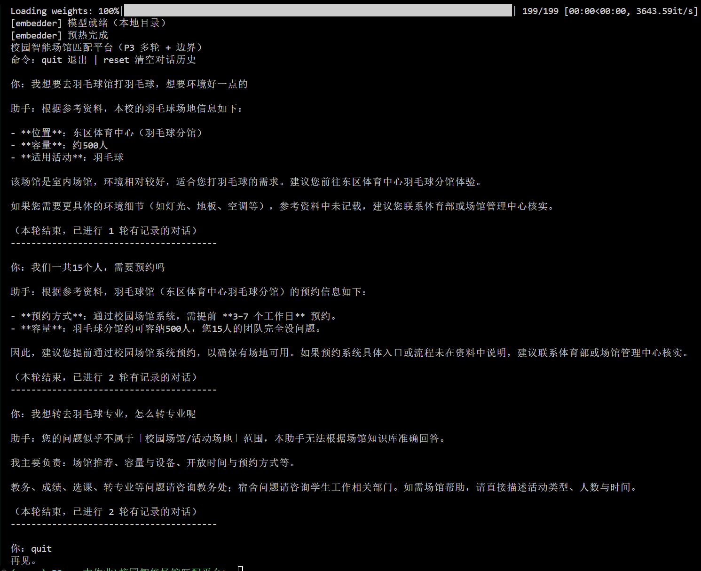

# 实验报告：校园智能场馆匹配平台

## 一、项目背景与目标

（简述校园场馆预约痛点、本项目要解决的问题。）

## 二、技术方案

- 知识库构建：`knowledge/` 目录下的场馆 Markdown 资料
- 检索模块：`retriever.py`（当前为关键词检索，可扩展向量检索）
- 大模型推理：`llm.py` 封装 API，结合检索结果生成推荐

## 三、实现过程

（记录主要开发步骤、遇到的问题与解决方法。）

## 四、测试与结果

### 4.1 测试环境说明

| 项目 | 说明 |
|------|------|
| 测试时间 | 2026-06-04 |
| 运行方式 | 项目根目录执行 `python main.py`（P3 多轮对话 + 边界处理） |
| 大模型 | DeepSeek API（`deepseek-chat`） |
| 检索 | `sentence_transformers` + 本地模型缓存（`EMBEDDING_LOCAL_ONLY=True`，启动预热） |
| **知识库** | **假数据 / 示例库**：仅 `knowledge/示例-体育馆.md`、`knowledge/示例-游泳馆.md` 共 2 份占位文档，**非本校真实场馆信息**；正式交付前需替换为 ≥15 份本校资料并 `indexer.py --rebuild` |

以下三轮对话为同一次 CLI 会话的实录（摘自终端运行记录），用于验证 **RAG 推荐**、**多轮上下文**（第 2 轮承接第 1 轮场馆话题）与 **越界拒答**（第 3 轮）。

*图 1：`python main.py` 终端联调实录（知识库为 `示例-体育馆.md` 等占位假数据）。完整截图见 `docs/images/p3-main-cli-test-2026-06-04.png`。*

---

### 4.2 P3 多轮对话实录（示例知识库）

#### 第 1 轮：场馆推荐（RAG 命中）

**用户：** 我想要去羽毛球馆打羽毛球，想要环境好一点的

**助手：**

> 根据参考资料，本校的羽毛球场地信息如下：
>
> - **位置**：东区体育中心（羽毛球分馆）
> - **容量**：约500人
> - **适用活动**：羽毛球
>
> 该场馆是室内场馆，环境相对较好，适合您打羽毛球的需求。建议您前往东区体育中心羽毛球分馆体验。
>
> 如果您需要更具体的环境细节（如灯光、地板、空调等），参考资料中未记载，建议您联系体育部或场馆管理中心核实。

**观察：** 回答内容与 `示例-体育馆.md` 中「东区体育中心、羽毛球分馆、约 500 人」等字段一致，未编造库外场馆名称。

---

#### 第 2 轮：多轮追问（承接上文，补充预约信息）

**用户：** 我们一共15个人，需要预约吗

**助手：**

> 根据参考资料，羽毛球馆（东区体育中心羽毛球分馆）的预约信息如下：
>
> - **预约方式**：通过校园场馆系统，需提前 **3–7 个工作日** 预约。
> - **容量**：羽毛球分馆约可容纳500人，您15人的团队完全没问题。
>
> 因此，建议您提前通过校园场馆系统预约，以确保有场地可用。如果预约系统具体入口或流程未在资料中说明，建议联系体育部或场馆管理中心核实。

**观察：** 在未重复说明「羽毛球馆」的前提下，系统仍围绕上一轮推荐的东区羽毛球分馆作答，并引用知识库中的预约规则（提前 3–7 个工作日），体现多轮上下文与 RAG 结合。

---

#### 第 3 轮：越界问题（边界处理）

**用户：** 我想转去羽毛球专业，怎么转专业呢

**助手：**

> 您的问题似乎不属于「校园场馆/活动场地」范围，本助手无法根据场馆知识库准确回答。
>
> 我主要负责：场馆推荐、容量与设备、开放时间与预约方式等。
>
> 教务、成绩、选课、转专业等问题请咨询教务处；宿舍问题请咨询学生工作相关部门。如需场馆帮助，请直接描述活动类型、人数与时间。

**观察：** 问题含「转专业」等越界关键词，系统**未调用场馆检索胡编**，而是返回固定边界话术并引导至教务处；符合任务书「库外/非本域不编造」要求。

---

### 4.3 小结

| 轮次 | 测试意图 | 结果 |
|------|----------|------|
| 1 | 语义检索 + 场馆推荐 | 命中示例体育馆资料，推荐合理 |
| 2 | 多轮对话（人数、预约） | 承接上文，引用预约条款 |
| 3 | 边界处理（转专业） | 拒答并提示职责范围 |

**说明：** 因知识库为示例假数据，结论仅证明流程正确；替换本校真实 `knowledge/*.md` 并重建索引后，应复测相同用例并更新本节与图 1。

## 五、总结与展望

（收获、不足、后续改进方向。）
